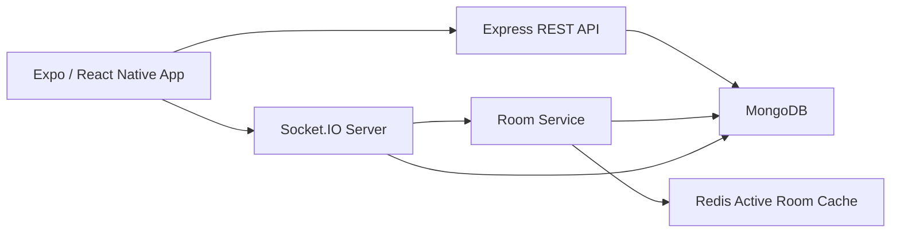
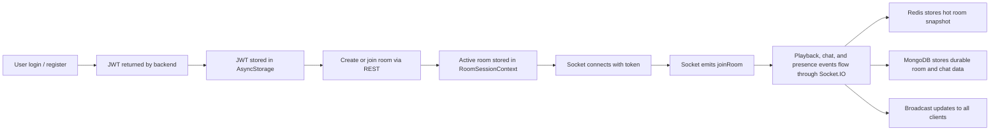

# System Overview

## Summary

CoWatch is a 3-layer system:

1. `frontend/`: an Expo + React Native client that handles authentication, room UX, playback UI, and chat.
2. `backend/`: an Express API with Socket.IO for authenticated real-time room events.
3. Data layer: MongoDB for durable persistence and Redis for hot room state.

The main product flow is:

1. A user registers or logs in and receives a JWT.
2. The app stores that JWT locally and uses it for REST and Socket.IO authentication.
3. A user creates or joins a room over HTTP.
4. The room session context opens a socket connection for that room.
5. Playback, presence, and chat events move through Socket.IO.
6. Redis keeps the live room snapshot current, while MongoDB stores durable room and chat data.

The synchronization model is host-authoritative:

- Only the host can change playback state.
- The server validates membership and host ownership before applying playback changes.
- The backend updates the canonical room snapshot and broadcasts the new state to all room members.
- Non-host clients follow that canonical state and locally correct playback drift when needed.

## High-Level Architecture

## Core Flow

## Design Principles

- One room has one playback authority: the host.
- HTTP is used for auth, room creation/joining, and room hydration.
- Socket.IO is used for live room activity after the user is inside a room.
- Redis stores active session state because it changes frequently.
- MongoDB stores durable user, room, and chat records.
- The sync strategy is eventual consistency, not frame-perfect clock sync.

## Current Limits

- This is currently a single-backend-instance design.
- Socket.IO is not using a Redis adapter for multi-instance fan-out.
- Video input is limited to direct `.mp4` and `.m3u8` URLs.
- The private room flag is metadata only and does not enforce invite-only access.
- Some home and discovery surfaces are still placeholder UI.

## Next

- For app state and UI structure, read [Client Architecture](02-client-architecture.md).
- For APIs, sockets, and server flow, read [Backend Architecture](03-backend-architecture.md).
- For playback sync specifically, read [Realtime Synchronization](05-realtime-synchronization.md).
