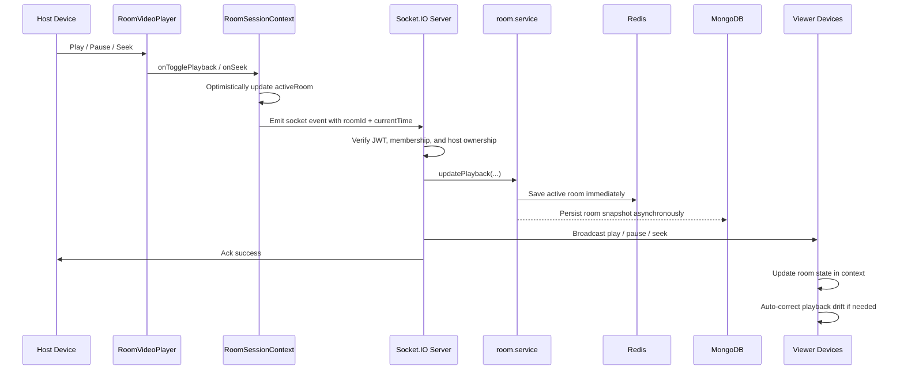

# Realtime Synchronization

## Core Idea

CoWatch uses host-authoritative synchronization.

That means:

- only the host can change playback
- the server validates every playback-changing action
- the server updates the canonical room state
- all viewers follow that canonical state

This avoids conflicting playback commands from multiple users.

## Where The Sync Logic Lives

Frontend:

- [`frontend/context/RoomSessionContext.tsx`](../frontend/context/RoomSessionContext.tsx)
- [`frontend/components/ui/RoomVideoPlayer.tsx`](../frontend/components/ui/RoomVideoPlayer.tsx)

Backend:

- [`backend/src/sockets/room.events.ts`](../backend/src/sockets/room.events.ts)
- [`backend/src/modules/rooms/room.service.ts`](../backend/src/modules/rooms/room.service.ts)

## End-To-End Playback Flow

## Frontend Sync Responsibilities

`RoomSessionContext`:

- emits playback events through the socket
- binds the current socket to the active room after REST create / join / hydrate
- updates room state optimistically for the host
- rolls back if the ack reports failure
- listens for `play`, `pause`, and `seek` broadcasts
- listens for `roomUpdated` snapshots to keep room membership in sync
- derives join / leave system messages from room membership diffs so the embedded watch-room chat stays consistent with the participant list

`RoomVideoPlayer`:

- converts player events into room actions
- keeps local playback aligned to `roomIsPlaying` and `roomCurrentTime`
- prevents non-host viewers from becoming their own authority

## Backend Sync Responsibilities

`room.events.ts`:

- validates room membership
- rejects playback actions from non-host users
- calls the room service to update room state
- broadcasts the canonical result to the room
- emits `roomUpdated` when room membership changes so all connected clients receive the same participant snapshot

`room.service.ts`:

- updates the active room snapshot
- stores the current `currentTime`, `isPlaying`, and `videoUrl`
- writes the active state to Redis
- persists the room snapshot to MongoDB

## Drift Correction Strategy

The app is not trying to keep every device on exactly the same media clock tick.

Instead, it uses convergence:

1. host sets the authoritative action
2. backend stores and broadcasts that action
3. viewers update their local room state
4. players snap back if drift becomes too large

Key thresholds in `RoomVideoPlayer.tsx`:

- `SYNC_DRIFT_THRESHOLD_SECONDS = 1.25`
- `SEEK_JUMP_THRESHOLD_SECONDS = 1.5`
- `SEEK_COMMIT_DELAY_MS = 250`

Practical meaning:

- small timing differences are tolerated
- large jumps are treated as explicit seeks
- repeated sync events do not re-apply unnecessarily

## Why Non-Hosts Cannot Freely Control Playback

Non-host viewers are followers, not authorities.

Enforcement on the frontend:

- `togglePlayback` and `seekPlayback` return early unless the user is the host
- `requiresLinearPlayback={!isHost}` reduces free seeking for viewers

Enforcement on the backend:

- `play`, `pause`, `seek`, and `videoChange` are rejected unless the sender is the host

This double enforcement is important because UI restrictions alone are not enough.

## Why This Sync Model Is A Good Fit

Benefits:

- simpler than peer-to-peer or clock-synchronization systems
- easier to debug
- predictable conflict resolution
- works well for mobile watch-party usage

Tradeoff:

- synchronization is eventual, not frame-perfect

That tradeoff is reasonable here because the product values simplicity and reliability more than sub-second precision.

## Presence Sync Notes

Playback is not the only realtime concern. Room presence uses a slightly different pattern:

1. create / join still happens durably through REST
2. the frontend then binds the current socket to that room
3. reconnect binds are silent, while first-time joins may request an announce
4. the backend emits a `roomUpdated` snapshot whenever room membership changes
5. clients update `activeRoom.users` from that snapshot
6. the watch-room screen reflects the latest participant count and shows embedded join / leave system messages

This snapshot-first approach is important because presence correctness matters more than trusting a single `userJoined` or `userLeft` event in isolation.
