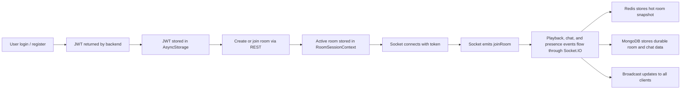
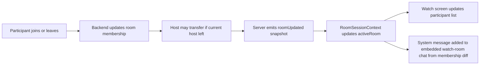

# Workflows, Recovery, And Validation

## Main Room Lifecycle

## Presence And Membership Flow

## Recovery And Hydration Flow

When a user opens the watch screen directly or reconnects later:

1. The frontend calls `GET /rooms/:roomId`
2. The backend checks Redis for the active room
3. If Redis misses, the backend loads the room snapshot from MongoDB
4. If the room is valid, the backend writes it back into Redis
5. The frontend restores `activeRoom`
6. The socket reconnects and emits `joinRoom`

This is how the app recovers from interrupted sessions without forcing a full manual rejoin in many cases.

## Failure And Recovery Behavior

### JWT-based socket authentication

Sockets use the same JWT model as REST.

Benefits:

- only authenticated users can connect
- each socket is tied to a real `userId`
- room actions are attributable to a real authenticated user

### Reconnect behavior

`RoomSessionContext` re-emits `joinRoom` when the socket reconnects and an active room is still present.

This helps with:

- short network interruptions
- app-level reconnects
- restoring live room presence after transport drops

Reconnect joins are silent, so the app restores socket membership without generating a fake "joined the room" message for everyone else.

### Host reassignment

When the host leaves, `room.service.leaveRoom` promotes the first remaining participant to host.

This preserves the session instead of destroying it immediately.

### Last-user cleanup

When the final participant leaves:

- Redis active room state is deleted
- Mongo room snapshot is deleted
- Mongo chat messages for that room are deleted

This prevents abandoned room data from lingering forever.

## Validation Scenarios

### Auth

- Register a new user and confirm a JWT is returned
- Log in with valid credentials and confirm the session is restored after app restart
- Confirm protected room APIs reject missing or invalid tokens
- Confirm sockets reject invalid tokens

### Room

- Create a room and confirm the creator becomes host
- Join using the 6-character code and confirm the participant appears in the room user list
- Open the watch screen directly and confirm hydration via `GET /rooms/:roomId`
- Reconnect and confirm `joinRoom` is re-emitted

### Playback

- Host play, pause, and seek actions update all participants
- Non-host playback actions do not take control locally and are rejected by the backend if attempted
- Viewer drift above the threshold is corrected
- Optimistic host updates roll back when the server rejects them

### Presence

- Joining updates all clients through `roomUpdated`
- Leaving updates all clients through `roomUpdated`
- First-time joins may also emit `userJoined`, but participant count correctness should come from the room snapshot
- Host departure transfers ownership
- Last-user departure purges room artifacts

### Chat

- Chat messages broadcast immediately to connected clients
- Chat messages are persisted in MongoDB
- Non-members cannot send room chat messages

## What To Read Next

- For overall context, read [System Overview](01-overview.md)
- For app-side behavior, read [Client Architecture](02-client-architecture.md)
- For sync internals, read [Realtime Synchronization](05-realtime-synchronization.md)
