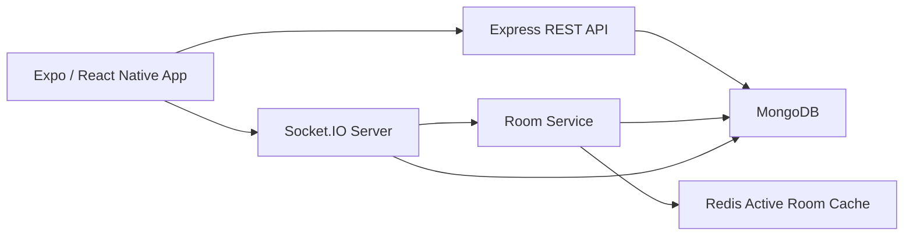
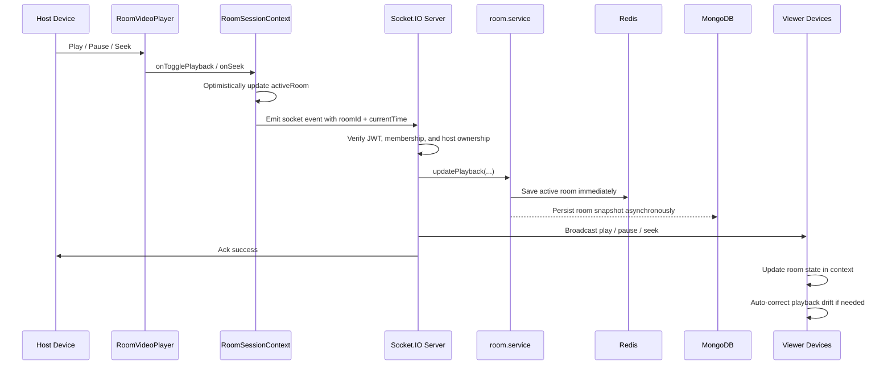
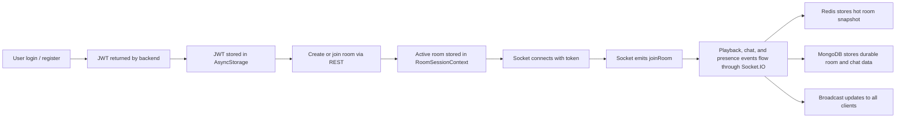
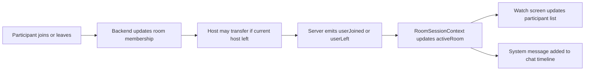

# CoWatch System Design

## Summary

CoWatch is a 3-layer system:

1. `frontend/`: an Expo + React Native client that handles authentication, room UX, playback UI, and chat.
2. `backend/`: an Express API with Socket.IO for authenticated real-time room events.
3. Data layer: MongoDB for durable persistence and Redis for hot room state.

The main product flow is:

1. A user registers or logs in and receives a JWT.
2. The app stores that JWT locally and uses it for REST and Socket.IO authentication.
3. A user creates or joins a room over HTTP.
4. The room session context opens a socket connection for that room.
5. Playback, presence, and chat events move through Socket.IO.
6. Redis keeps the live room snapshot current, while MongoDB stores durable room and chat data.

The synchronization model is host-authoritative:

- Only the host can change playback state.
- The server validates membership and host ownership before applying playback changes.
- The backend updates the canonical room snapshot and broadcasts the new state to all room members.
- Non-host clients follow that canonical state and locally correct playback drift when needed.

## High-Level Architecture

## Client Architecture

### 1. App bootstrap and navigation

The app starts in [`frontend/app/_layout.tsx`](../frontend/app/_layout.tsx).

- `AuthProvider` restores the saved session from `AsyncStorage`.
- `RoomSessionProvider` owns the active room, messages, and socket lifecycle.
- `RootNavigator` redirects users between the auth stack and the main app tabs based on whether a JWT exists.

Routing structure:

- `frontend/app/(auth)`: login and registration
- `frontend/app/(app)`: home, create room, join room, watch room, profile, discover

### 2. Authentication state

[`frontend/context/AuthContext.tsx`](../frontend/context/AuthContext.tsx) is the session/bootstrap layer.

Responsibilities:

- Restores `co_watch_token` and `co_watch_user` from `AsyncStorage` on app startup
- Applies the bearer token to Axios through `setAuthToken`
- Exposes `login`, `register`, and `logout` helpers
- Makes the authenticated user available to the rest of the app

Why it matters:

- REST endpoints use the JWT in the `Authorization` header.
- Socket.IO also uses the same JWT during the handshake.
- This keeps HTTP and real-time layers aligned under the same identity.

### 3. Room session state and sockets

[`frontend/context/RoomSessionContext.tsx`](../frontend/context/RoomSessionContext.tsx) is the room orchestration layer.

Responsibilities:

- Tracks the active room object and room-level loading/error state
- Stores in-room chat messages
- Opens and tears down the socket connection
- Attaches socket listeners for playback, chat, and presence events
- Exposes room actions like:
  - `createAndJoinRoom`
  - `joinExistingRoom`
  - `hydrateRoom`
  - `leaveActiveRoom`
  - `sendChatMessage`
  - `togglePlayback`
  - `seekPlayback`

Important behavior:

- After room creation or join over REST, the context opens a Socket.IO connection using the JWT.
- On socket reconnect, it emits `joinRoom` again if there is still an active room.
- It performs optimistic UI updates for host playback changes, then rolls back if the server rejects the action.
- It treats room state as shared session state for the watch screen.

### 4. Playback adapter and client-side sync protection

[`frontend/components/ui/RoomVideoPlayer.tsx`](../frontend/components/ui/RoomVideoPlayer.tsx) is the playback adapter between the native video player and room state.

It uses `expo-video` and applies room state to the player:

- `roomIsPlaying` drives whether the local player should play or pause
- `roomCurrentTime` is used to resync local playback when drift grows too large
- fullscreen changes are delegated back to the screen

It also converts native player behavior back into room actions:

- If the host manually plays or pauses, it calls `onTogglePlayback`
- If the host seeks, it debounces the seek and calls `onSeek`

Sync guardrails built into the player:

- `SYNC_DRIFT_THRESHOLD_SECONDS = 1.25`
- `SEEK_JUMP_THRESHOLD_SECONDS = 1.5`
- Non-host viewers cannot freely control playback because `requiresLinearPlayback={!isHost}`
- If a non-host tries to drift away or manually jump, the player snaps back to the room state

This means the client does not attempt perfect real-time media clock sync. Instead, it uses host authority plus drift correction to stay aligned.

### 5. Screen-level flow

The main room experience lives in [`frontend/app/(app)/watch-room.tsx`](../frontend/app/(app)/watch-room.tsx).

What this screen does:

- Hydrates room state when opened directly by room id
- Displays playback, participants, and chat
- Uses `RoomVideoPlayer` for media playback
- Lets the host control playback
- Lets all room members send chat messages
- Prevents accidental navigation away without leaving the room cleanly

Supporting screens:

- [`frontend/app/(auth)/login.tsx`](../frontend/app/(auth)/login.tsx): logs in with `/auth/login`
- [`frontend/app/(auth)/register.tsx`](../frontend/app/(auth)/register.tsx): registers with `/auth/register`
- [`frontend/app/(app)/create-room.tsx`](../frontend/app/(app)/create-room.tsx): validates the video URL and creates a room
- [`frontend/app/(app)/join-room.tsx`](../frontend/app/(app)/join-room.tsx): joins by 6-character room code

Current product limitation:

- The app only accepts direct `.mp4` and `.m3u8` URLs via [`frontend/utils/video.ts`](../frontend/utils/video.ts).
- YouTube, Vimeo, and Twitch are intentionally not supported yet.

## Backend Architecture

### 1. Process bootstrap

[`backend/src/server.ts`](../backend/src/server.ts) is the backend entrypoint.

Startup sequence:

1. Load environment variables
2. Create an HTTP server around Express
3. Create a Socket.IO server on top of that HTTP server
4. Register socket handlers
5. Connect to MongoDB
6. Connect to Redis
7. Start listening on port `5000` by default

[`backend/src/app.ts`](../backend/src/app.ts) configures Express:

- `cors()`
- JSON and URL-encoded request parsing
- `/auth` routes
- `/rooms` routes
- `/health` endpoint
- shared error middleware

### 2. Authentication API

Auth endpoints:

- [`backend/src/modules/auth/auth.routes.ts`](../backend/src/modules/auth/auth.routes.ts)
- [`backend/src/modules/auth/auth.controller.ts`](../backend/src/modules/auth/auth.controller.ts)
- [`backend/src/modules/auth/auth.service.ts`](../backend/src/modules/auth/auth.service.ts)

How auth works:

1. A user submits credentials to `/auth/register` or `/auth/login`
2. The service reads or creates the user in MongoDB
3. Passwords are hashed with `bcrypt`
4. A JWT is generated with [`backend/src/utils/jwt.ts`](../backend/src/utils/jwt.ts)
5. The frontend stores that token and reuses it for all protected actions

Protected HTTP routes use [`backend/src/middleware/auth.middleware.ts`](../backend/src/middleware/auth.middleware.ts), which:

- reads the bearer token
- verifies it with `jsonwebtoken`
- attaches `{ userId, username }` to `req.user`

### 3. Room HTTP API

Room endpoints live in:

- [`backend/src/modules/rooms/room.routes.ts`](../backend/src/modules/rooms/room.routes.ts)
- [`backend/src/modules/rooms/room.controller.ts`](../backend/src/modules/rooms/room.controller.ts)

Supported operations:

- `POST /rooms/create`
- `POST /rooms/join`
- `POST /rooms/leave`
- `PATCH /rooms/:roomId/playback`
- `GET /rooms/:roomId`

In practice:

- Room creation and joining happen over REST from the mobile client
- `GET /rooms/:roomId` is used as a hydration and recovery path
- Socket.IO is the primary real-time interaction channel after that

### 4. Socket.IO real-time layer

Socket setup is in [`backend/src/sockets/socket.handler.ts`](../backend/src/sockets/socket.handler.ts).

What happens on connection:

1. The socket handshake must include a JWT
2. The backend verifies the token
3. The decoded user is attached to the socket
4. Room event handlers are registered

On disconnect:

- The backend loops over joined rooms
- If the socket user is a member of a room, the service removes them
- The server emits `userLeft` to the rest of the room

Room events live in [`backend/src/sockets/room.events.ts`](../backend/src/sockets/room.events.ts).

Handled events:

- `createRoom`
- `joinRoom`
- `leaveRoom`
- `play`
- `pause`
- `seek`
- `videoChange`
- `chatMessage`

Each event follows the same pattern:

1. Validate required input
2. Ensure the room exists
3. Ensure the user belongs to the room when needed
4. For playback-changing actions, ensure the user is the host
5. Update room state through `room.service`
6. Broadcast the result to the room
7. Return success or failure through the Socket.IO ack callback

## Data Design

### 1. MongoDB: durable persistence

MongoDB stores:

- users in [`backend/src/models/user.model.ts`](../backend/src/models/user.model.ts)
- room snapshots in [`backend/src/modules/rooms/room.model.ts`](../backend/src/modules/rooms/room.model.ts)
- chat messages in [`backend/src/modules/chat/chat.model.ts`](../backend/src/modules/chat/chat.model.ts)

Why MongoDB exists here:

- It persists room state across process restarts
- It stores durable chat history
- It backs authentication user records

### 2. Redis: active room cache

Redis integration lives in [`backend/src/config/redis.ts`](../backend/src/config/redis.ts).

Active room state is stored in keys shaped like:

`room:active:{roomId}`

This is managed in [`backend/src/modules/rooms/room.service.ts`](../backend/src/modules/rooms/room.service.ts).

Why Redis is used:

- Playback and presence state changes frequently
- Reading and writing the current room snapshot should be fast
- Redis stores the active room with TTL so inactive sessions can expire naturally

Default TTL behavior:

- `ROOM_ACTIVE_TTL_SECONDS` defaults to 6 hours

### 3. Shared room contract

The shared room shape is defined across:

- [`backend/src/modules/rooms/room.types.ts`](../backend/src/modules/rooms/room.types.ts)
- [`frontend/types/index.ts`](../frontend/types/index.ts)

Important fields:

- `roomId`
- `roomName`
- `hostId`
- `videoUrl`
- `currentTime`
- `isPlaying`
- `isPrivate`
- `users`

This object is the canonical shared state between:

- REST responses
- socket event payloads
- frontend room context
- Redis room snapshots
- MongoDB room documents

## Realtime Synchronization Design

### Host-authoritative playback

The most important system decision in this project is that the host is the only playback authority.

Why this matters:

- Prevents conflicting play/pause/seek commands from multiple users
- Makes server validation simple and predictable
- Gives every client one canonical playback timeline to follow

Backend enforcement:

- `play`, `pause`, `seek`, and `videoChange` all verify that the user is the room host before changing state

Frontend enforcement:

- `togglePlayback` and `seekPlayback` do nothing unless the current user matches `activeRoom.hostId`
- Non-host viewers are configured for linear playback and are resynced if they drift away

### Playback sync workflow

### What makes sync stable enough in practice

This app uses eventual consistency, not frame-perfect synchronization.

The strategy is:

1. Let the host drive playback changes
2. Save the resulting room snapshot centrally
3. Broadcast the change immediately
4. Have each client apply the new room state
5. Let non-host clients self-correct if they drift too far

Specific client protections:

- small remote sync updates are ignored if they look like the same sync already applied
- large jumps are treated as seeks
- non-host manual jumps are rejected by snapping back
- paused viewers are forced to the canonical room time if they drift

This is a good fit for mobile watch-party behavior because it is simple, understandable, and resilient without requiring low-level media clock synchronization.

## Main Workflows

### 1. Main room lifecycle

### 2. Presence and membership flow

### 3. Recovery and hydration flow

If the user enters the watch screen directly or reconnects later:

1. The frontend calls `GET /rooms/:roomId`
2. The backend loads the room from Redis first
3. If Redis does not have it, the backend hydrates it from MongoDB
4. If the room is still valid, it is cached back into Redis
5. The frontend restores the active room and reconnects the socket
6. On reconnect, the socket emits `joinRoom` again

This gives the app a reliable fallback path when the real-time connection is interrupted or the screen is reopened.

## Failure And Recovery Behavior

### JWT-based socket authentication

The socket server uses the same JWT model as the REST API.

Why this is useful:

- only authenticated users can connect
- each socket is tied to a known `userId` and `username`
- room membership changes can be safely attributed to a real user

### Reconnect behavior on the client

`RoomSessionContext` listens for socket reconnects and re-emits `joinRoom` when an active room exists.

This means:

- transient network interruptions do not require a full manual rejoin
- the room session can recover without rebuilding all UI state from scratch

### Host reassignment

When a host leaves, `room.service.leaveRoom` promotes the first remaining user to host.

That keeps the room alive and preserves the session for everyone still inside.

### Last-user cleanup

When the final participant leaves a room, `room.service` purges all room artifacts:

- remove active room state from Redis
- delete the room document from MongoDB
- delete stored chat messages for that room

This keeps the system from accumulating abandoned room state forever.

## Test And Validation Scenarios

### Auth flow

- Register a new user and confirm a JWT is returned
- Log in with existing credentials and confirm the JWT is restored on app restart
- Verify protected room REST APIs reject missing or invalid tokens
- Verify socket connections fail without a valid JWT

### Room flow

- Create a room and confirm the creator becomes host
- Join with the 6-character room code and confirm the participant appears in `users`
- Open the watch screen directly and confirm `GET /rooms/:roomId` hydrates room state
- Reconnect the socket and confirm the client rejoins the room

### Playback flow

- Host play/pause/seek succeeds and updates all participants
- Non-host playback actions are ignored on the client and rejected by the server if attempted
- Viewer drift larger than the threshold is corrected automatically
- Host optimistic playback updates roll back if the server rejects the action

### Presence flow

- Joining emits `userJoined` and updates participant UI
- Leaving emits `userLeft` and adds a system message
- Host departure transfers ownership to the next participant
- Last-user departure deletes room and chat artifacts

### Chat flow

- Chat messages broadcast immediately to connected clients
- Chat messages are written to MongoDB for durability
- Room membership is enforced before accepting a chat message

## Assumptions And Current Limits

- This is currently a single-backend-instance design.
- Socket.IO is not using a Redis adapter, so multi-instance fan-out is not implemented yet.
- Redis is the hot source of truth for active sessions.
- MongoDB is the durable backup for room snapshots and chat history.
- Synchronization is eventual and host-driven, not frame-perfect.
- The private room flag is currently metadata only; it does not enforce invite-only access.
- The home/discover/recent-room experience is still partially placeholder UI.
- Video input is limited to direct `.mp4` and `.m3u8` URLs.

## Why This Design Works Well For This Project

This design is a practical fit for a watch-party app because it separates concerns cleanly:

- the mobile app owns UX and local playback
- the backend owns authority, validation, and fan-out
- Redis handles fast-changing live room state
- MongoDB handles durability

Most importantly, the project avoids over-engineering the sync problem. Instead of trying to perfectly synchronize media clocks across devices, it uses a simpler model:

- one host decides playback
- one backend validates and broadcasts it
- every client converges toward the same room state

That tradeoff keeps the implementation understandable while still delivering a solid real-time shared watching experience.
