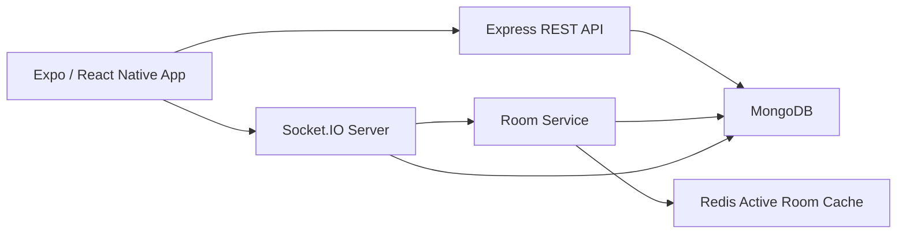

# CoWatch System Design

This guide is now split into smaller docs so you can study one concern at a time.

## Reading Order

1. [System Overview](01-overview.md)
2. [Client Architecture](02-client-architecture.md)
3. [Backend Architecture](03-backend-architecture.md)
4. [Data Design](04-data-design.md)
5. [Realtime Synchronization](05-realtime-synchronization.md)
6. [Workflows, Recovery, and Validation](06-workflows-recovery-and-validation.md)

## Quick View

CoWatch is a 3-layer watch-party system:

- Expo / React Native frontend for auth, room UX, playback, and chat
- Express + Socket.IO backend for APIs and room events
- Redis + MongoDB for active session state and durable persistence

## Best File For Each Question

- "What is this project overall?": [System Overview](01-overview.md)
- "How does the app state work?": [Client Architecture](02-client-architecture.md)
- "How do the server routes and sockets work?": [Backend Architecture](03-backend-architecture.md)
- "Why both Redis and MongoDB?": [Data Design](04-data-design.md)
- "How is playback kept in sync?": [Realtime Synchronization](05-realtime-synchronization.md)
- "How do reconnects, host transfer, and cleanup work?": [Workflows, Recovery, and Validation](06-workflows-recovery-and-validation.md)
